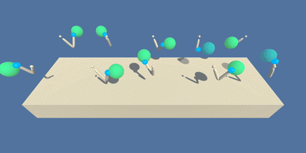

#Project 2: Continuous Control

**1. Overview**

The Continuous Control project has a double-jointed arm (the agent’s arm) that can move to target locations. The agent is given a reward of +0.1 for each step that the agent’s hand is in the target or goal location. Thus the goal is for the agent to maintain its position at the target location for as many time steps as possible. Note this environment is continuous and here we solve the multi-agent environment.

The Reacher environment

### Rewards
A reward of +0.1 is awarded for keeping the arm in the target location for as many time steps as possible. Thus the goal of our agent is to maintain its position in the target location for as many times as possible and in the process get an average score of +30 over 100 consecutive episodes.
### States
The state space has 33 variables corresponding to position, rotation, velocity and angular velocities of the arm.
### Actions
Each action is a vector with four numbers corresponding to torque applicable to two joints.  Every entry in the action vector should be a number between -1 and 1.

The task is episodic and in order to solve the environment, the agent must get an average score of +30 over 100 
consecutive episodes.

**2. Getting Started**

1. Download the environment from one of the links below. You need only select the environment that matches your operating system:

* Linux: [Click Here](https://s3-us-west-1.amazonaws.com/udacity-drlnd/P2/Reacher/Reacher_Linux.zip/ "Linux")

* Mac OSX: [Click Here](https://s3-us-west-1.amazonaws.com/udacity-drlnd/P2/Reacher/Reacher.app.zip/ "Mac OS")

* Windows (32-bit): [Click Here](https://s3-us-west-1.amazonaws.com/udacity-drlnd/P2/Reacher/Reacher_Windows_x86.zip/ "Windows 32 bit")

* Windows (64-bit): [Click Here](https://s3-us-west-1.amazonaws.com/udacity-drlnd/P2/Reacher/Reacher_Windows_x86_64.zip/ "Windows 64 bit")

(For Windows users) Check out [this link](https://support.microsoft.com/en-us/help/827218/how-to-determine-whether-a-computer-is-running-a-32-bit-version-or-64) if you need help with determining if your computer is running a 32-bit version or 64-bit version of the Windows operating system.

(For AWS) If you'd like to train the agent on AWS (and have not enabled a virtual screen), then please use [this link](https://s3-us-west-1.amazonaws.com/udacity-drlnd/P1/Banana/Banana_Linux_NoVis.zip) to obtain the environment.

2. Place the file in the p1_navigation/ folder, and unzip (or decompress) the file.

**3. Project Instructions**

Follow the instructions in Continuous_Control.ipynb to get started training the agents with the different provided algorithms.
